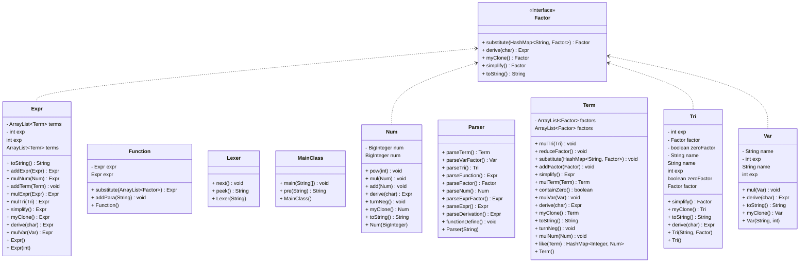

```mermaid
classDiagram
direction BT
class Expr {
  - ArrayList~Term~ terms
  - int exp
   int exp
   ArrayList~Term~ terms
  + toString() String
  + addExpr(Expr) Expr
  + mulNum(Num) Expr
  + addTerm(Term) void
  + mulExpr(Expr) Expr
  + mulTri(Tri) Expr
  + simplify() Expr
  + myClone() Expr
  + derive(char) Expr
  + mulVar(Var) Expr
  + Expr() 
  + Expr(int) 
}
class Factor {
<<Interface>>
  + substitute(HashMap~String, Factor~) Factor
  + derive(char) Expr
  + myClone() Factor
  + simplify() Factor
  + toString() String
}
class Function {
  - Expr expr
   Expr expr
  + substitute(ArrayList~Factor~) Expr
  + addPara(String) void
  + Function() 
}
class Lexer {
  + next() void
  + peek() String
  + Lexer(String) 
}
class MainClass {
  + main(String[]) void
  + pre(String) String
  + MainClass() 
}
class Num {
  - BigInteger num
   BigInteger num
  + pow(int) void
  + mul(Num) void
  + add(Num) void
  + derive(char) Expr
  + turnNeg() void
  + myClone() Num
  + toString() String
  + Num(BigInteger) 
}
class Parser {
  + parseTerm() Term
  + parseVarFactor() Var
  + parseTri() Tri
  + parseFunction() Expr
  + parseFactor() Factor
  + parseNum() Num
  + parseExprFactor() Expr
  + parseExpr() Expr
  + parseDerivation() Expr
  + functionDefine() void
  + Parser(String) 
}
class Term {
  - ArrayList~Factor~ factors
   ArrayList~Factor~ factors
  + mulTri(Tri) void
  + reduceFactor() void
  + substitute(HashMap~String, Factor~) void
  + addFactor(Factor) void
  + simplify() Expr
  + mulTerm(Term) Term
  + containZero() boolean
  + mulVar(Var) void
  + derive(char) Expr
  + myClone() Term
  + toString() String
  + turnNeg() void
  + mulNum(Num) void
  + like(Term) HashMap~Integer, Num~
  + Term() 
}
class Tri {
  - int exp
  - Factor factor
  - boolean zeroFactor
  - String name
   String name
   int exp
   boolean zeroFactor
   Factor factor
  + simplify() Factor
  + myClone() Tri
  + toString() String
  + derive(char) Expr
  + Tri(String, Factor) 
  + Tri() 
}
class Var {
  - String name
  - int exp
   String name
   int exp
  + mul(Var) void
  + derive(char) Expr
  + toString() String
  + myClone() Var
  + Var(String, int) 
}

Expr  ..>  Factor 
Num  ..>  Factor 
Tri  ..>  Factor 
Var  ..>  Factor 
```